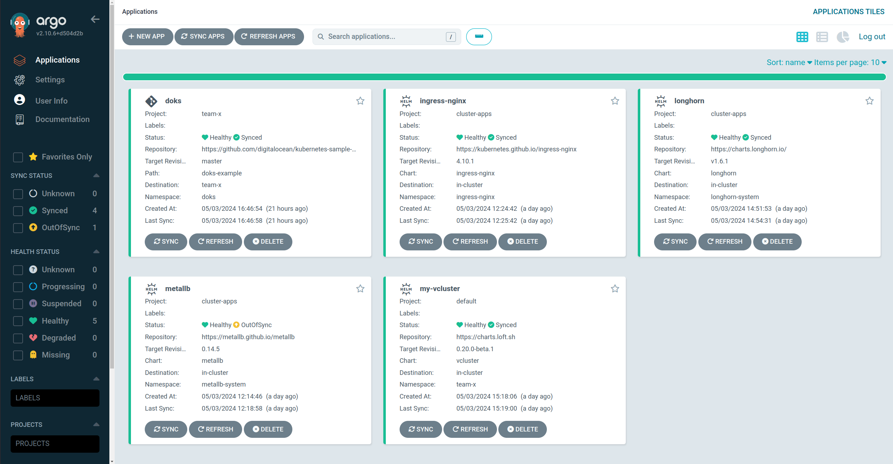
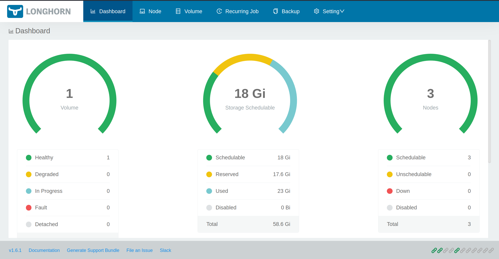
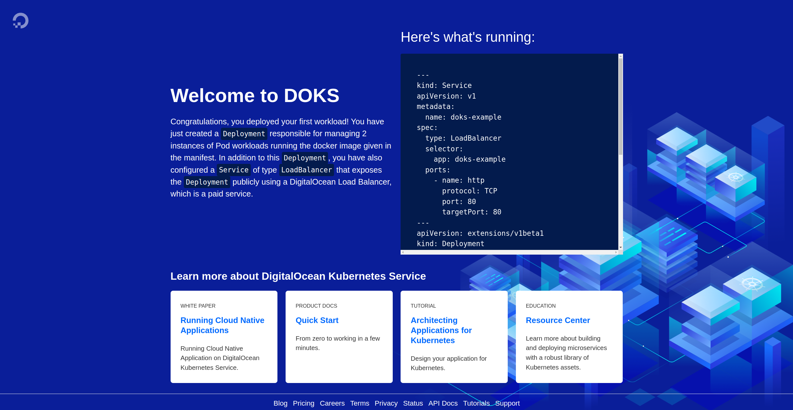

# Kubernetes in Vagrant (with libvirt)

This is a fully functional self-contained lab to deploy a "realistic" kubernetes cluster in libvirt VMs.
This is for learning and testing purposes, therefore, several security considerations have been omitted. 

## Requirements
- [Vagrant](https://developer.hashicorp.com/vagrant/install?product_intent=vagrant)
- [vagrant-libvirt](https://vagrant-libvirt.github.io/vagrant-libvirt/)

## Machine Setup
1. Deploy the cluster, one by one.
```bash
cd vagrant
vagrant up control-plane --provider=libvirt
vagrant up node-1 --provider=libvirt
vagrant up node-2 --provider=libvirt
vagrant up node-3 --provider=libvirt
```
There is a problem with vagrant-libvirt plugin that prevents spining up more than one machine at the time.

As part of machine setup, (see `vagrant/Vagrantfile` for details) these will be provisioned via ansible playbooks (see `ansible/` for details). 

The kubernetes cluster will be provisioned and configured as part of the setup. When provisioning the controlplane, a join command will be generated and stored ina shared directory for the nodes to pick up (see `resources/`). When provisioning the nodes, they will pick up the join command from `resources/` shared folder and automatically join the cluster.

**Note:** By default, `calico` CNI is installed in the cluster. If one wants to use a different CNI, please modify `ansible/master-playbook.yaml` accordingly.

This will give you a fully functional bare-metal kubernetes cluster. From the control-plane machine, you will be able to operate with `kubectl` as usual.

## Post-Setup stuff
Most in this section is optional, depending on the experiment one wants to carry out. Although, the order in which are listed is relevant, they should be applied in the same order.

For all, ssh into the control plane first:
```bash
vagrant ssh control-plane
# Falls into vagrant@control-plane:~$
```

### Metrics API
Enabling Metrics API server.

```bash
k apply -f https://github.com/kubernetes-sigs/metrics-server/releases/latest/download/components.yaml
# Edit metrics-server deployment to disable tls check
k -n kube-system edit deploy metrics-server
################
containers:
  - args:
    - --cert-dir=/tmp
    - --secure-port=10250
    - --kubelet-preferred-address-types=InternalIP,ExternalIP,Hostname
    - --kubelet-use-node-status-port
    - --kubelet-insecure-tls  ### Add this
    - --metric-resolution=15s
################
```
Alternatively, download the manifests and edit them before apply or use kustomize.

**Note:** Disabling tls is not recommended for production environments.

### CoreDNS Fix - Necessary in this lab
In libvirt VM environment, there is a problem with dnsmasq. External DNS resolution
works on the guests, but it doesn't within the pods. The obvious workaround would
be to add external DNS servers to /etc/resolv.conf within the gustes, for example
google's dns `8.8.8.8`. However, dnsmasq manages the /etc/resolv.conf
files of the guests, and any changes to this file will be wiped out when the guest
renews the dchp lease. If one doesn't want to deal with this configuration from libvirt 
& dnsmasq perspective, the solution is to edit the default `coredns` configmap as
follows:
```bash
k -n kube-system edit cm coredns
###########
apiVersion: v1
data:
  Corefile: |
    .:53 {
        errors
        health {
           lameduck 5s
        }
        ready
        kubernetes cluster.local in-addr.arpa ip6.arpa {
           pods insecure
           fallthrough in-addr.arpa ip6.arpa
           ttl 30
        }
        prometheus :9153
        # forward . /etc/resolv.conf {  Change This
        forward . 8.8.8.8 /etc/resolv.conf { # To this
           max_concurrent 1000
        }
        cache 30
        loop
        reload
        loadbalance
    }
###########
```
This way, coredns will use additional dns servers on top of the hosts
default one for the pods. You can use any other DNS servers other than google's.


#### References:
- https://github.com/kubernetes-sigs/metrics-server
- https://github.com/kubernetes-sigs/metrics-server/issues/812


### ArgoCD
ArgoCD is a GitOps platform for kubernetes. It will help keeping applications in kubernetes in sync with respect to a ground truth source (git or helm) and custom defined values. This repo contains some manifests to deploy some other applications as ArgoCD resources.

```bash
# Install ArgoCD
k create ns argocd
k -n argocd apply -f https://raw.githubusercontent.com/argoproj/argo-cd/stable/manifests/install.yaml

# Install argocd cli
curl -sSL -o argocd-linux-amd64 https://github.com/argoproj/argo-cd/releases/latest/download/argocd-linux-amd64
sudo install -m 555 argocd-linux-amd64 /usr/local/bin/argocd
rm argocd-linux-amd64

# Get admin credentials
argocd admin initial-password -n argocd

# Login via CLI
argocd login <ADDRESS>:<PORT>
```
**Note:** Address and port vary depending on how you wish to expose `argocd-server` pod or service. See official docs for details.

Some ArgoCD applications from now on, deploy applications in a `cluster-apps` project. If you want to install them, please create the projects accordingly. Speacially:
```bash
# cluster-apps project needed for ingress-nginx, longhorn, and metallb
k create -f /resources/argocd-apps/cluster-apps-project.yaml
# team-x project only needed if deploying vCluster
k create -f /resources/argocd-apps/cluster-apps-project.yaml
```



#### References:
- [ArgoCD](https://argo-cd.readthedocs.io/en/stable/getting_started/)
- [Issue Adding itself](https://github.com/argoproj/argo-cd/issues/4204)
- [UI Base Path](https://argo-cd.readthedocs.io/en/stable/operator-manual/ingress/#ui-base-path)

### MetalLB (LoadBalancer IP manager)
Because this is a bare-metal cluster, there is no LoadBalancer implementation. This means that services of type LoadBalancer will never get an external IP from where they can be reached from outside the cluster. This in cloud environments is handled by their corresponding implementations e.g. aws ELB, etc.

MetalLB is a CNCF project to enable LoadBalancer IP management in bare-metal clusters. In essence, once installed, you can create an address pool from where the LB can grab and assign to services of type LoadBalancer.

Installing this is completely optional, however, it might help provide a more "realistic" experience when exposing applications outside the cluster, for example via ingress.

#### Installation
First, create a namespace 
```bash
k create ns metallb-system
```
Then label the namespace to mark it as privileged
```bash
k label ns metallb-system pod-security.kubernetes.io/enforce=privileged \
    pod-security.kubernetes.io/audit=privileged \
    pod-security.kubernetes.io/warn=privileged
```
There is an ArgoCD manifest to create MetalLB deployment in the cluster. You cand find in `resources/argocd-apps/metallb.yaml`. Simply installit from the control-plane node.
```bash
k create -f /resources/argocd-apps/metallb.yaml
```
After that, create an address pool and an advertisement with the manifest `resources/manifests/metallb-address-pool.yaml`. Again from the control-plane.
```bash
k create -f /resources/manifests/metallb-address-pool.yaml
```
**Note:** Remember to update the address list in case you have a different network configuration.

#### References
- [MetalLB](https://metallb.universe.tf)

### Ingress NGINX
The cluster doesn't install any ingress solution out of the box. Ingress nginx is installable as an argocd application. Check `resources/argocd-apps/ingress-nginx.yaml`. 

#### Installation
From the control-plane
```bash
k create -f /resources/argocd-apps/ingress-nginx.yaml
```

#### Ingress for ArgoCD
After ingress-nginx is deployed, an ingress rule can be deployed for ArgoCD itself to enable access from outside the cluster. The manifest can be found at `resources/manifests/argocd-ingress.yaml`

To install, from the control-plane:
```bash
k create -f /resources/manifests/argocd-ingress.yaml
```
##### Ingress Note
Because the ingress manifest for argo in this project is configured to serve argo on path `/argocd`, 
argocd-server deployment needs to be updated so the ui can take into accoung the redirection of
http resources:
```bash
k -n argocd edit deploy argocd-server
spec:
  template:
    spec:
      name: argocd-server
      containers:
      - args:
        - /usr/local/bin/argocd-server
        ## Add the two lines below
        - --basehref
        - /argocd

```

### Longhorn (storage)
Longhorn is another CNCF project developed by Rancher to provide highly available persistent storage for kubernetes clusters. In essence, it will help you with volume provisioning and management with little intervention. So there is no need to manually create volumes and coordinating where to deploy pods based on where they were created, nor installing another more complex storage solution like Ceph.

For the purposes of this lab, longhorn is perfect as it just needs to be installed with default configurations, it will automatically deploy csi drivers and use storage available in the nodes. It will also enable automatic provisioning for pods with persistent volume claims and it will configure the necessary components to enable access to the volumes from any pod, in case a pod gets rescheduled in another node, the volume connection will be preserved.

#### Installation
In this repo, longhorn is provided as an ArgoCD application, the manifest is located at `resources/argocd-apps/longhorn.yaml`. Install it from the control-plane.

First, check Longhorn is installable
```bash
curl -sSfL https://raw.githubusercontent.com/longhorn/longhorn/v1.6.1/scripts/environment_check.sh | bash
```
The script will let you know what requirements are missing. Although this repo already prepares the machines so it should pass without further action.

Then proceed to install:
```bash
k create -f /resources/argocd-apps/longhorn.yaml
```

If you want, you can also expose longhonr's ui in the same ingress controller as argo but in a different path. Simple apply the following manifest:
```bash
k create -f /resources/manifests/longhorn-ingress.yaml
```



#### References
- [Longhorn](https://longhorn.io)
- https://longhorn.io/docs/1.6.1/deploy/install/#installation-requirements
- https://github.com/longhorn/longhorn/issues/4853


### vCluster
vCluster is a tool to create and manage virtual kubernetes clusters inside kubernetes, i.e., cluster-in-cluster. This lab can be used to test it and even add virtual clusters to ArgoCD so these can be managed and apps installed in them.

virtual clusters can even be created as ArgoCD applications, this repo contains one vcluster manifest in `resources/argocd-apps/my-vcluster.yaml`. From the control-plane simply create the resource:
```bash
k create -f /resources/argocd-apps/my-vcluster.yaml
```
The new cluster will be provisioned and managed by ArgoCD. The corresponding kubeconfig for the new vCluster is created as a secret in the same namespace where the app is deployed. To get it:
```bash
k -n team-x get secrets vc-my-vcluster --template={{.data.config}} | base64 -d > my-vcluster-kubeconfig.yaml
```
By default, this secret assumes the url of the cluster is `https://localhost:8443`, but this won't work outside the cluster. To find which target you need to point to, first get the node where the kube-server pod from `team-x` namespace is running.
```bash
k -n team-x get pods -o wide
####### 
NAME           READY   STATUS    RESTARTS   AGE   IP               NODE     NOMINATED NODE   READINESS GATES
my-vcluster-0  1/1     Running   0          22h   <Node IP>        node-2   <none>           <none>
``` 
Then update the obtained `my-vcluster-kubeconfig.yaml` and change `localhost` for the obtained ip.

Now you can use the new kubeconfig to manage the virtual cluster:
```bash
k --kubeconfig my-vcluster-kubeconfig.yaml get all
```
You might want to expose the `my-vcluster-0` pod in other ways in order to reach it outside the cluster, just update the kubeconfig with the new url if necessary.

#### Adding vCluster to ArgoCD
For this, you need to be logged in with argocd CLI, see instructions above. After being logged in, just use the vCluster's kubeconfig to add it.
```bash
argocd cluster add team-x --project team-x --kubeconfig my-vcluster-kubeconfig.yaml
```
The cluster should now appear in ArgoCD and be manageable from there.

**Note:** You might need to create the project in ArgoCD beforehand, otherwise just deploy it in the default project.

#### Deploying an app to managed vCluster in ArgoCD
Finally, applications can be deployed to the managed cluster. There is one example as an argocd manifest in this repo:
```bash
# Update the server ip before apply, this is the vCluster ip according to the deployment.
k create -f /resources/argocd-apps/team-x-doks-app.yaml
```


#### Installing vCluster CLI tool
```bash
# Install CLI
curl -L -o vcluster "https://github.com/loft-sh/vcluster/releases/download/v0.20.0-beta.1/vcluster-linux-amd64" && sudo install -c -m 0755 vcluster /usr/local/bin && rm -f vcluster
```

 argocd cluster add team-x --project team-x --kubeconfig my-vcluster-kubeconfig.yaml
#### References
- https://www.vcluster.com/docs/get-started?x0=4&x1=5&x6=1